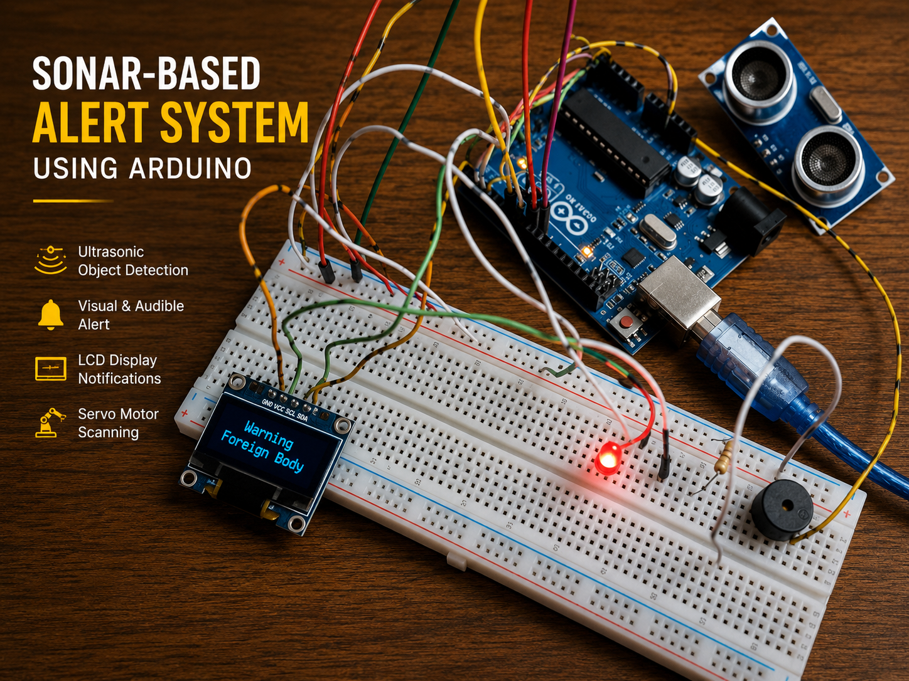
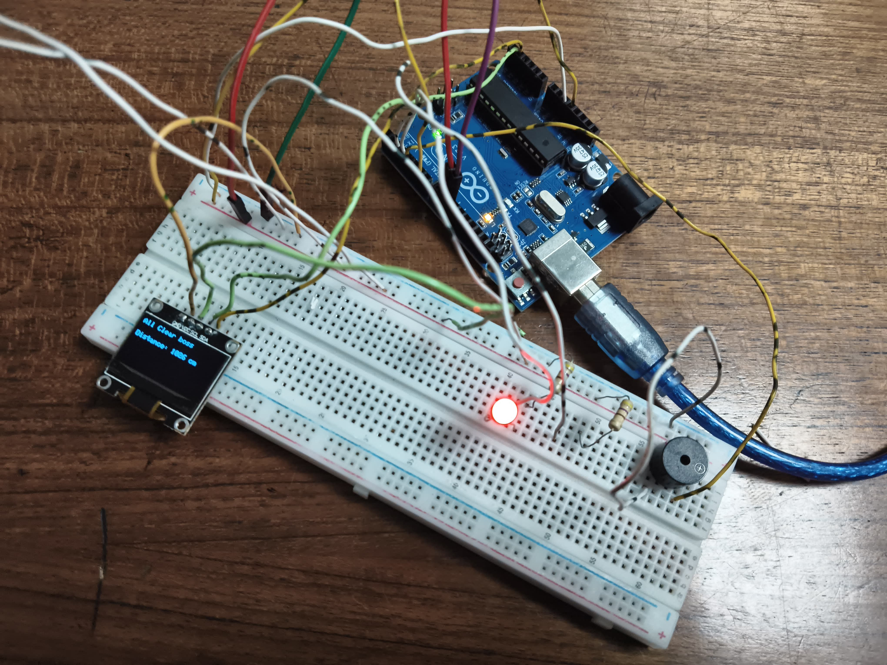
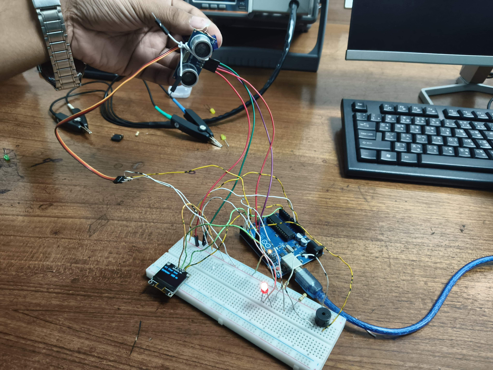
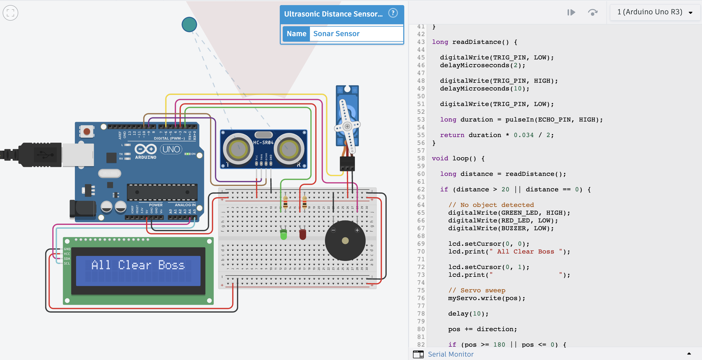
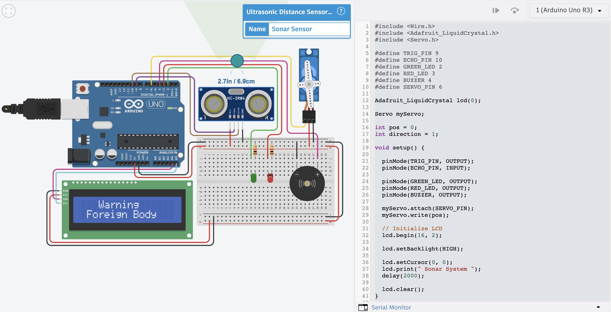

# Sonar-Based Alert System Using Arduino

An Arduino-based embedded system that continuously monitors a designated area using an **HC-SR04 Ultrasonic Sensor**. When a foreign object is detected within **20 cm**, the system immediately activates visual and audible alerts while displaying a warning message on the OLED display.

> Developed as part of the **Microprocessor and Embedded Systems** course at **American International University-Bangladesh (AIUB)**.

---

## Project Overview

This project continuously monitors a designated area using an ultrasonic sensor. During normal operation, the system displays **"All Clear"** along with the measured distance, keeps the **green LED ON**, and continuously scans the surroundings using a servo motor. When an object enters the detection range (within **20 cm**), the system turns **ON the red LED**, activates the **buzzer**, stops the servo motor, and displays **"Warning"** and **"Foreign Body"** on the OLED display. Once the object is removed, the system automatically resumes normal monitoring.

---

## Features

- Real-time object detection
- Continuous area monitoring
- OLED status display
- Servo motor scanning
- Visual and audible alerts
- Automatic recovery after object removal

---

## Components Used

- Arduino Uno R3
- HC-SR04 Ultrasonic Sensor
- OLED Display (I2C)
- SG90 Servo Motor
- Red LED
- Green LED
- Piezo Buzzer
- Breadboard
- Resistors
- Jumper Wires

---

## Repository Structure

```text
sonar-based-alert-system-arduino/
│
├── README.md
├── LICENSE
│
├── Code/
│   └── Sonar_based_alert_System_arduino.ino
│
├── Circuit/
│   ├── Wiring-Diagram.pdf
│   └── Components.csv
│
├── Images/
│   ├── Cover.png
│   ├── Prototype-1.jpg
│   ├── Prototype-2.jpg
│   ├── Simulation-All-Clear.png
│   └── Simulation-Warning.png
│
└── Video/
    └── Demo-Video.mp4
```

---

## Project Images

### Project Cover

> **Note:** The cover image has been enhanced for presentation purposes. The original hardware prototype images are available below and in this repository.



### Hardware Prototype

| Prototype 1 | Prototype 2 |
|--------------|--------------|
|  |  |

### Simulation

#### Area Clear



#### Object Detected



---

## Documentation

This repository includes:

- Arduino source code
- Wiring diagram
- Components list
- Hardware prototype images
- Tinkercad simulation
- Project demonstration video

---

## Demo Video

A complete working demonstration is available in the **Video** folder (`Demo-Video.mp4`).

---

## Technologies Used

- Arduino IDE
- Embedded C (Arduino)
- Tinkercad
- Sensor Interfacing
- I2C Communication

---

## Future Improvements

- ESP32 Wi-Fi integration
- Mobile application support
- Data logging
- Adjustable detection threshold
- Multiple ultrasonic sensors

---

## Author

**Md Junayed Rahman**

B.Sc. in Computer Science & Engineering (CSE)  
American International University-Bangladesh (AIUB)

---

## License

This project is licensed under the **MIT License**.